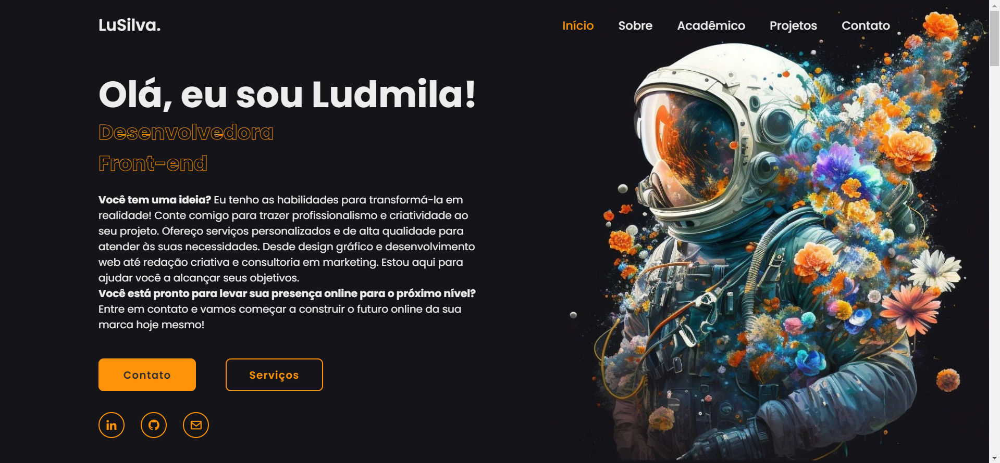

<h1 align="center"><b>Portfólio  </b></h1>
<h1 align="center"></h1>
<h1 >📚  Sobre</h1>

 Este é o meu portfólio de desenvolvedora, onde apresento alguns dos meus projetos e habilidades em programação.

 

<h1 >🚀  Tecnologias utilizadas</h1>
✔️ HTML5  
✔️ CSS3  
✔️ Javascript  
✔️ Java
 

---

<h1 > Link dos projetos incluídos neste portfólio </h1>

- [Super Mario JavaScript](https://lusilva710.github.io/SuperMario_JavaScript/): Um clone do jogo Super Mario Bros desenvolvido em JavaScript.

- [Cardápio Digital](https://lusilva710.github.io/LandingPage_FoodService/): Uma landing page para um cardápio digital de um serviço de alimentação.

- [Simulador de Financiamento (Java)](https://github.com/LuSilva710/Calculadora_Financiamento_Java): Uma aplicação em Java para simulação de financiamentos.

- [Landing Page - Canil Duke](https://lusilva710.github.io/CanilDuke/): Uma landing page para um canil fictício.

---

<h1> 📠Licença </h1> 

- Esse projeto está sob a licença MIT. Veja o arquivo [LICENSE](https://github.com/LuSilva710/LandingPage_FoodService/blob/main/LICENSE) para mais detalhes.

---
<h1> Contato </h1> 

  
  
  

---
Copyright (c) 2023  
Feito com ♥ by @Lu Silva :wave:

---
